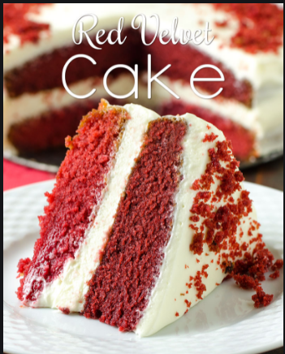

<h1>
CAKES
</h1>

<b><h2>
RED VELVET CAKE
</h2></b>
<i>
<h3>This is the best red velvet cake you will ever have. This classic cake is unbelievably moist, fluffy, flavorful, and perfectly red. Its the real thing!</h3>
</i>
<b>
<h3>Red velvet cake is traditionally a red, red-brown, crimson, or scarlet-colored chocolate layer cake, layered with ermine icing. Traditional recipes do not use food coloring, with the red color due to non-Dutched, anthocyanin-rich cocoa.</h3>
</h3>
<h4><i>
Velvet cake is thought to have originated in Maryland in the early 20th century. In the 19th century, "velvet" cake, a soft and velvety crumb cake, came to be served as a fancy dessert, in contrast to what had been the more common, coarser-crumbed cake. Around the turn of the 20th century, devil's food cake was introduced, which is how some believe that red velvet cake came about. The key difference between the two cakes is that devil's food cake uses chocolate and red velvet cake uses cocoa
</i><h4>