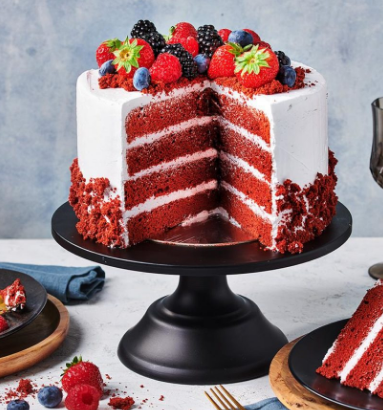

<h1>
<u>Instructions</u>
</h1>

<ol><i>
<h3>To make the cake: </h3>
<li>Preheat oven to 350°F/180°C. Grease two 8-inch or 9-inch cake pans that are at least 2-inches high, and line the bottom of the pan with a round piece of parchment paper.</li>
<li>In a medium bowl, sift together flour, cornstarch, cocoa powder, baking soda, and salt. Set aside.</li>
<li>In a standing mixer fitted with the paddle attachment, beat together butter and sugar on medium speed until light and fluffy, 3-4 minutes. Scrape down the sides and bottom of the bowl as necessary. Beat in oil.</li>
<li> The batter might look a bit curdled, that's ok. Add eggs, one at a time, mixing well between each addition. Add vanilla and vinegar and beat until combined. Add red food coloring, until desired color is reached. With the mixer on low speed, add half of the dry ingredients and beat just until combined. Add buttermilk, followed by the rest of the dry ingredients. Do not over mix.</li>
<li>Divide batter evenly between pans. Bake for 30-35 minutes or until a toothpick inserted into the center comes out clean. Allow cakes to cool in the pan on a wire rack until they're easy to handle, then remove from pan and allow to cool completely on a wire rack.</li>
<h3>To make the frosting: </h3>
<li>In the bowl of an electric mixer fitted with the paddle attachment, beat butter and cream cheese on medium-high speed until smooth and creamy, 1-2 minutes. Add sugar in 2 additions, beating well after each addition until smooth. Add vanilla and salt and keep beating until smooth and fluffy.</li>
<h3>Assembling the cake: </h3>
<li>Set one layer on a plate with the flat side facing up (or, if your cake rose too much, cut its rounded top with a knife to make it flat). Evenly spread a thick layer of the frosting over the cake to the edge. Top with the second cake layer, rounded side up. Spread the remaining frosting over the top and sides of the cake.</li>
</i></ol>
